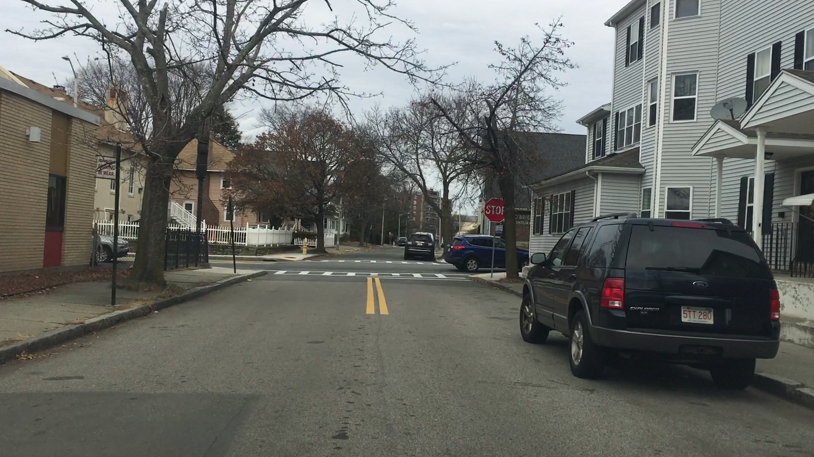

# Traffic_sign_detection_YOLO
Detecting traffic signs using YOLO algorithm

1) Clone the repo
2) cd darkflow and build cython extension
3) build globally with "pip install ."
4) check if "flow" works with "flow --h"
5) download and extract LISA dataset into the dataset folder
6) run datasetGenerator.py
7) Create built_graph folder inside darkflow if not training and save pb and meta files there
8) set GPU to 0.0 in the config3.json if not using GPU
9) RunYOLO 
